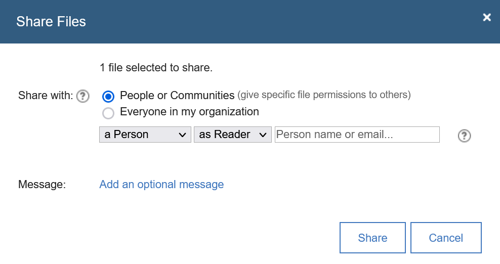

# Disable File / Folder Sharing with Entire Organization
This example is provided as-is and can be used to prevent a user selecting the option labeled 'Share with my organization' when creating or sharing files or folders with a web browser. The option is still visible in the UI but the radio button or menu selection is disabled and so cannot be selected by a user.

The script will disable the selection in the following locations when using a web browser:

**File Upload Dialog**
The radio button is inactive.


**Folder Upload Dialog**
The radio button is inactive.


**File Share Dialog (launched from the file list views)**
The radio button is inactive.


**Folder Share Dialog (launched from the folder list views)**
The radio button is inactive.


**Sharing Panel in the File Viewer**
The drop down menu option *Everyone in my organization* is not selectable.


**NOTES:** 
1. This change is being performed in the front end browser app only and has no corresponding server-side or configuration change. Thus it has no effect on sharing options available via desktop plugins, mobile applications or other API-based interactions and should be seen as a way to **limit** organization-wide sharing but **not prevent it** entirely.

2. This only affects sharing options set on new files or folders, it will not prevent or change access to content already shared with the entire organization.
   
3. A file or folder owner can **remove** the share with my organization setting from existing files or folders. 

## Enabling the Customization Extension
If your organization already makes use of the Customizer technology, then proceed with the administrator instructions to set up the extension.

The files that disable the sharing option are made available and are directly accessible from the public git repository [HCL-TECH-SOFTWARE/connections-samples](https://github.com/HCL-TECH-SOFTWARE/connections-samples/tree/main/customizer/samples) in the [disable-org-file-share](https://github.com/HCL-TECH-SOFTWARE/connections-samples/tree/main/customizer/samples/disable-org-file-share) directory.

As an administrator of the organization, do the following:

1. Put the custom JS script file [files_org_block.js](https://github.com/HCL-TECH-SOFTWARE/connections-samples/blob/main/customizer/samples/disable-org-file-share/files_org_block.js) into the Connections environment in a **/pv-connections/customizations/disable-org-file-share** directory.
2. Launch the appregistry UI at **/appreg/apps** URL (requires admin access).
3. Click the **New App** button to create an extension definition.
4. Go to the **Code Editor** section and remove the example JSON outline.
5. Paste in the content of the [disable-org-file-share.json](https://github.com/HCL-TECH-SOFTWARE/connections-samples/blob/main/customizer/samples/disable-org-file-share/disable-org-file-share.json) file.
6. If necessary, modify the **include-files path and file name** to match the location and name of the JS script file.
7. (OPTIONAL) To apply the extension to a subset of users add a *match* rule to the payload section and within it list the email addresses of the users who will be affected by the extension. This can be used in combination with a test account to check the behaviour before enabling for all users. See examples below.
8. (OPTIONAL) To explicitly prevent the extension from affecting a subset of users add an *exclude* rule to the payload section and within it list the email addresses of the users who will not be affected by the extension. See examples below.
9.  (OPTIONAL) If you did use a *match* or *exclude* rule for testing the extension but are ready to enable for all users in the organization, simply remove the *match* and / or *exclude* elements from the JSON.

**TIP:** Consider leaving administrator accounts excluded from the extension.

## Additional Payload Examples
### Extension Applies to Only Specified Users
```json
"payload": {
    "include-files": [
        "disable-org-file-share/files_org_block.js"
    ],
    "cache-headers": {
        "cache-control": "max-age=43200"
    },
    "match": {
        "user-email": [
            "include1@domain.com",
            "include2@domain.com"
        ]
    }
}
```
  
### Extension Does Not Apply to Specified Users
```json
"payload": {
    "include-files": [
        "disable-org-file-share/files_org_block.js"
    ],
    "cache-headers": {
        "cache-control": "max-age=43200"
    },
    "exclude": {
        "user-email": [
            "exclude1@domain.com",
            "exclude2@domain.com"
        ]
    }
}
  
```
## Validating the Extension is Loaded
Use the following procedure:

1. Open the browser development tools panel.

2. Select the **Network** trace tab, filter the request types to only show JS content.

3. Log in with an account that should be affected by the extension and go to the Files app.

4. In the network request trace, you should see the request for the */files/customizer/disable-org-file-share/files_org_block.js* and a *200* response code.

5. Create new files or folders or share existing files and folders and very that the options to "Share with my organization" are not selectable as shown in the screenshots above.

