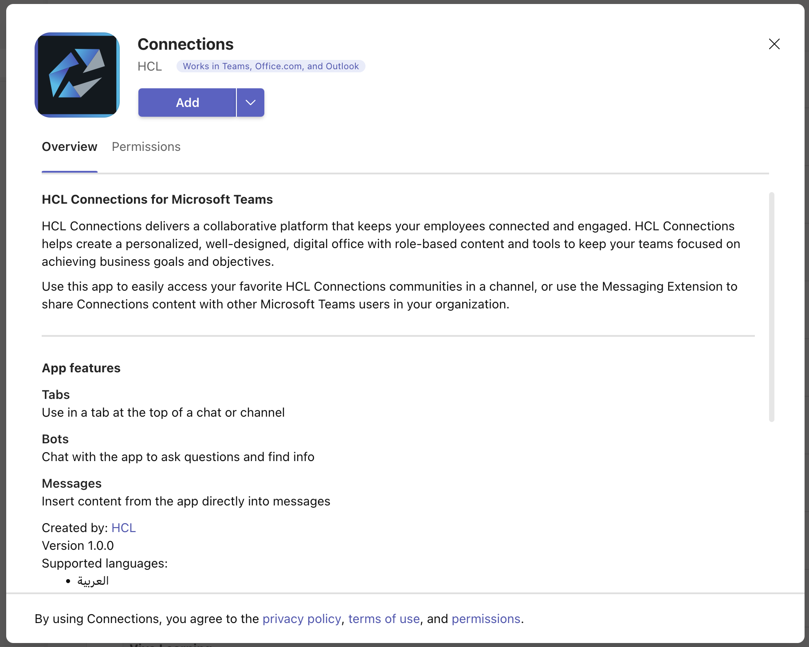

- [Connections Application Package for Microsoft Teams](#connections-application-package-for-microsoft-teams)
  - [Section 1 - General App Info](#section-1---general-app-info)
  - [Section 2 - Configuring Tabs](#section-2---configuring-tabs)
  - [Section 3 - Configuring Bots](#section-3---configuring-bots)
  - [Section 4 - Configuring Messaging Extensions](#section-4---configuring-messaging-extensions)
  - [Section 5 - Configuring Domains](#section-5---configuring-domains)
  - [Section 6 - Configuring Web Application SSO](#section-6---configuring-web-application-sso)
  - [Section 7 - Configuring Localization](#section-7---configuring-localization)
- [Packaging the App](#packaging-the-app)
- [Microsoft Teams App Manifest Reference Documentation](#microsoft-teams-app-manifest-reference-documentation)
<br>

# Connections Application Package for Microsoft Teams
The application manifest (and associated files) provided here [manifest.json](./sample/manifest.json) should be used as the starting point for defining the necessary Teams application which governs the integration of the Teams micro-services provided in the HCL Connections Component Pack.

The app package is ultimately a zip file that can be uploaded to the Teams admin center that saves having to provide the values manually via the admin UI. It is also a backup of the application configuration at a specific point in time. Adjustments can also be made to the app by uploading the zip file to the Teams Developer Portal.

The following items make up the zip content (see examples [here](./sample)):

| File Name | Purpose |
| --------- | ------- |
|color.png|Large app icon shown on app information page (see screenshot figure 1)|
|outline.png|Small app icon to launch messaging extension app from palette under conversations|
|manifest.json|Microsoft Teams application definition / configuration (described in detail below)|
|xx.json|JSON files containing string translations (one file per locale)
|||

There are a number of items that are customer or environment specific and these are indicated with placeholders such as *{Connections_Hostname}* that should be replaced accordingly.

The manifest is made up of a number of sections and each is treated in more detail below.

## Section 1 - General App Info
In this first part of the manifest, the application is described in terms of name, vendor, app version, links to relevant vendor pages for reference, app icons and accent color (by default the purple as seen on the open button in the Figure 1 screenshot).

This information is visible to users when they look for apps to add to channels or chats.

  
Figure 1: Application Information
<br>

Generally, a customer would not need to change these things but if for example, internal branding of the Connections applications uses a different name or icon, then a customer could modify these values to be more consistent:

```json
   "name": {
      "short": "Connections",
      "full": "HCL Connections"
   },
   "developer": {
      "name": "HCL",
      "mpnId": "1416163",
      "websiteUrl": "https://www.hcltechsw.com/connections",
      "privacyUrl": "https://www.hcltechsw.com/wps/portal/legal/privacy",
      "termsOfUseUrl": "https://www.hcltechsw.com/wps/portal/legal/terms-use"
   },
   "description": {
      "short": "HCL Connections for Microsoft Teams",
      "full": "HCL Connections delivers a collaborative platform that keeps your employees connected and engaged. HCL Connections helps create a personalized, well-designed, digital office with role-based content and tools to keep your teams focused on achieving business goals and objectives.\n\nUse this app to easily access your favorite HCL Connections communities in a channel, or use the Messaging Extension to share Connections content with other Microsoft Teams users in your organization."
   },
   "icons": {
      "outline": "outline.png",
      "color": "color.png"
   },
   "accentColor": "#01539B",
```
Either the icon files themselves can be replaced when packaged into the final manifest zip while keeping the same file name in the json, or the icons and file names could be changed.
<br>

## Section 2 - Configuring Tabs
In this section of the manifest, the scope of use for a tab app and URL for the microservice that will allow a user to choose the content to be displayed on the tab page are defined. A tab is a page displayed within a channel or group chat to render content.

The example shown below in Figure 2 is a Connections wiki page.


  
Figure 2: Tab App Content
<br>

The **configurationUrl** attribute value must be updated to include the host name at which Connections is accessed by replacing {Connections_Hostname}.

```json
   "configurableTabs": [{
      "configurationUrl": "https://%Connections_Hostname%/teams-tab",
      "canUpdateConfiguration": true,
      "scopes": ["groupChat", "team"],
      "context": ["channelTab"]
   }],
```
<br>

## Section 3 - Configuring Bots
A bot is used to insert message content into a conversation on behalf of an application. In this case, the messaging extension, described in [section 4](#section-4---configuring-messaging-extensions), requires a bot to insert a card into the conversation with a link to Connections content.

The botId/applicationId is generated when the bot is registered; see [Configuring an Azure App to Support the Microsoft Teams App]() in the Connections documentation. Use that id value to replace %Connections_AzureApplicationId%.

```json
   "bots": [{
      "botId": "%Connections_AzureApplicationId%",
      "scopes": ["team"],
      "isNotificationOnly": false,
      "supportsCalling": false,
      "supportsVideo": false,
      "supportsFiles": true
   }],
```
<br>

## Section 4 - Configuring Messaging Extensions
The messaging extension allows an end user to invoke the Connections app integration to choose to share a link from either their Connections recent history or files list in the current conversation.

  
Figure 3: Link to Content in Conversation
<br>

The **url** attribute value must be updated to include the host name at which Connections is accessed by replacing %Connections_Hostname%.

The botId/applicationId is generated when the bot is registered; see [Configuring an Azure App to Support the Microsoft Teams App]() in the Connections documentation. Use that id value to replace %Connections_AzureApplicationId%.

```json
   "composeExtensions": [{
      "botId": "%Connections_AzureApplicationId%",
      "commands": [{
         "id": "shareConnectionsContent",
         "type": "action",
         "title": "Connections Share",
         "description": "Share Connections content with other Microsoft Teams users",
         "initialRun": true,
         "fetchTask": false,
         "context": ["commandBox", "compose", "message"],
         "parameters": [{
               "name": "param",
               "title": "param",
               "description": "Share param",
               "inputType": "text"
         }]
      }],
      "canUpdateConfiguration": true
   }],
```

See [section 7](#section-7---configuring-localization) for details on translation of **title** and **description** strings.
<br>

## Section 5 - Configuring Domains
Valid domains identifies a list of target host or domain names for websites that Teams should allow access from within the Teams browser or client experience. For example, the tab app will show Connections content pages, so the host name or domain of the Connections deployment must be allowed. 

Replace the %Connections_Hostname% value in the json array with either the full Connections host name or appropriate domain name.

```json
   "validDomains": ["%Connections_Hostname%"],
```
<br>

## Section 6 - Configuring Web Application SSO
Replace the correct app id and resource url values to allow SSO to work with the app:
```json
   "webApplicationInfo": {
      "id": "%Connections_AzureApplicationId%",
      "resource": "api://%Connections_Hostname%/%Connections_AzureApplicationId%"
   },
```
<br>

## Section 7 - Configuring Localization
The information presented about the application, that is described in Section 1, can have translated content provided via a series of json files that contain the strings, one file per language.

The files are named LL.json where LL is the 2 character locale convention, for example, en.json, de.json, fr.json, etc.

Files for those three examples have been provided in this repo - for example, the [en.json](./sample/en.json) contains the following:

```json
{
    "$schema": "https://developer.microsoft.com/en-us/json-schemas/teams/v1.15/MicrosoftTeams.Localization.schema.json",
    "name.short": "Connections",
    "name.full": "HCL Connections",
    "description.short": "HCL Connections for Microsoft Teams",
    "description.full": "HCL Connections delivers a collaborative platform that keeps your employees connected and engaged. HCL Connections helps create a personalized, well-designed, digital office with role-based content and tools to keep your teams focused on achieving business goals and objectives.\n\nUse this app to easily access your favorite HCL Connections communities in a channel, or use the Messaging Extension to share Connections content with other Microsoft Teams users in your organization.",
    "composeExtensions[0].commands[0].title": "Connections Share",
    "composeExtensions[0].commands[0].description": "Share Connections content with other Microsoft Teams users",
    "composeExtensions[0].commands[0].parameters[0].title": "param",
    "composeExtensions[0].commands[0].parameters[0].description": "Share param"
}
```
<br>

Within the manifest, the files themselves are referenced so changing or adding more languages means modifying or adding the **languageTag** and **file** attributes for each of the languages needed as well as providing the translated json files:

```json
   "localizationInfo": {
      "defaultLanguageTag": "en",
      "additionalLanguages": [{
         "languageTag": "ar",
         "file": "ar.json"
      }, {
         "languageTag": "ca",
         "file": "ca.json"
      }, {
         "languageTag": "cs",
         "file": "cs.json"
      }, {
         "languageTag": "de",
         "file": "de.json"
      }, {
         "languageTag": "en",
         "file": "en.json"
      }, {
         "languageTag": "es",
         "file": "es.json"
      }, {
         "languageTag": "fi",
         "file": "fi.json"
      }, {
         "languageTag": "fr",
         "file": "fr.json"
      }, {
         "languageTag": "he",
         "file": "he.json"
      }, {
         "languageTag": "it",
         "file": "it.json"
      }, {
         "languageTag": "ja-jp",
         "file": "ja-jp.json"
      }, {
         "languageTag": "ko",
         "file": "ko.json"
      }, {
         "languageTag": "nl",
         "file": "nl.json"
      }, {
         "languageTag": "pl",
         "file": "pl.json"
      }, {
         "languageTag": "pt",
         "file": "pt.json"
      }, {
         "languageTag": "ru",
         "file": "ru.json"
      }, {
         "languageTag": "th",
         "file": "th.json"
      }, {
         "languageTag": "zh-tw",
         "file": "zh-tw.json"
      }, {
         "languageTag": "zh",
         "file": "zh.json"
      }]
   }
```
For more details about localization capabilities see the link to the *Localization File JSON Schema* resource at the end of this document.
<br>

# Packaging the App
A Teams app package is a .zip file containing the following - example shown in Figure 4.

* A manifest file named "manifest.json", which specifies attributes of the app and points to required resources for the user experience, such as the location of its tab configuration page or the Microsoft app ID for its bot.
  
* A transparent "outline" icon and a full "color" icon.
  
* Localized versions of string files describing the app.
<br>
  
Figure 4: App Package Content
<br>

The files can be zipped up using your favorite archive utility.  Just ensure that there are no folders contained within the zip files.  All files should be at the root level of the archive.

If you are using a terminal on a Mac or Linux, use something similar to the following:

  ```
  zip ConnectionsTeamsApp.zip *
  ```

Once the package is created it can be uploaded to the Teams admin center by an administrator and published for use in the organization apps catalog. 

For more details about publishing the app, see the link to the *Publish a Custom App by Uploading an App Package* resource at the end of this document.

<br>

# Microsoft Teams App Manifest Reference Documentation
The following information will be useful for reference when working with application manifests:

* Teams App Overview and Prereqs: https://docs.microsoft.com/en-us/microsoftteams/platform/build-your-first-app/build-first-app-overview
  
* Manifest Schema: https://docs.microsoft.com/en-us/microsoftteams/platform/resources/schema/manifest-schema

* Localization File JSON Schema: https://docs.microsoft.com/en-us/microsoftteams/platform/resources/schema/localization-schema

* Create an App Package for your Microsoft Teams App: https://docs.microsoft.com/en-us/microsoftteams/platform/concepts/build-and-test/apps-package

* Publish a Custom App by Uploading an App Package: https://docs.microsoft.com/en-us/MicrosoftTeams/upload-custom-apps
