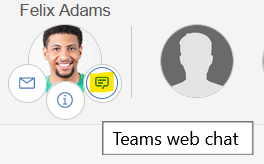
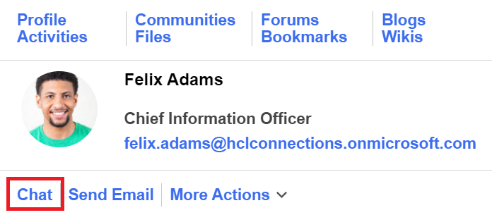
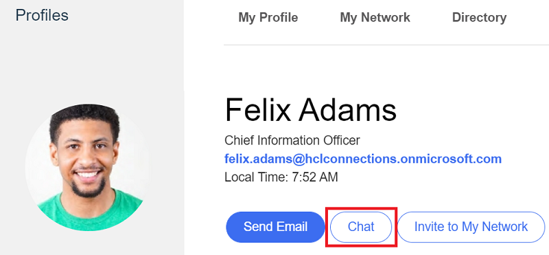

# Microsoft Teams 1-1 Chat
The appregistry extensions in this folder enable 1-1 chat from the important to me bar, the bizcard and the user profile page in Connections.

The json can either be imported from file or copied / pasted into the code editor of the appregistry client to create the extensions.

## Important to Me
Start a Teams chat directly from an ITM bubble:  


The example extension [ms-teams-itm.json](./ms-teams-itm.json) contains 3 different actions to launch a communication from the user bubble:

1. msteams - Start a 1-1 chat with user via the **msteams:** protocol handler which will switch to the Teams desktop client if installed and the user has chosen for that app to handle that protocol.

2. msteamsweb - Start a 1-1 chat with user via standard **https:** web link which will ask the user if they wish to continue in the Teams desktop client or the web browser.

3. sipcall - Start a call with user via **sip:** protocol handler which will switch to the Teams desktop client if installed and the user has chosen for that app to handle that protocol. This is disabled by default as Teams does not yet support the sip: protocol handler, but may in the future.

An administrator should enable the action that aligns best with the Teams client access methods in use in their organization. 
   
## Bizcard & Profiles
Start a chat directly from the bizcard:  


Start a chat directly from the profile:  


The json from [ms-teams-profile-bizcard.json](./ms-teams-profile-bizcard.json) can either be imported from file or copied / pasted into the code editor of the appregistry client to create the extension.

This one extension is used to enable the 1-1 chat for both bizcard and profile page. 

## Translations
The example extensions contain a limited number of translations as a way to demonstrate the technique. An administrator can add their own translations for the languages they desire by simply copying and pasting one of the langugage definition blocks, inserting the correct locale designation (e.g. es, ru, it, etc) and adding the desired string in the value attribute.

For example, to add Spanish translation for the bizcard and profile chat text, add a new language block like this:

```json
"es": {
   "TeamsBizcardChat-Connections_text": "Charla"
},
```