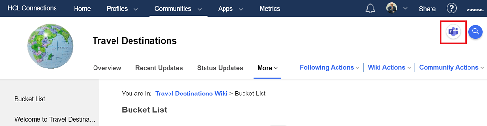
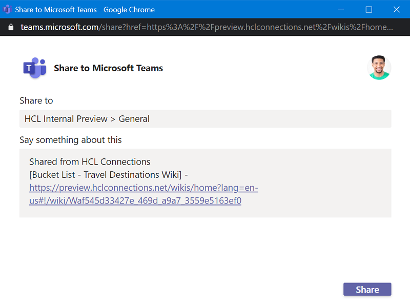
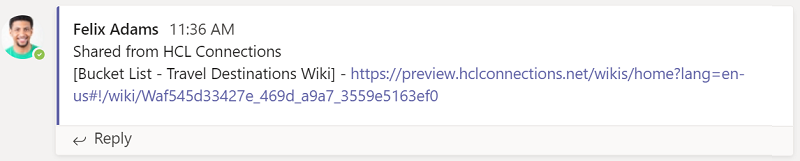

# Share to Microsoft Teams
This example injects a customization to display a Microsoft integration which allows the user to easily share a link to the current page they are viewing into a Teams channel.

The icon appears in the upper right corner of pages:  


After clicking, the user is asked to select the team and channel to which they wish to post the link and have the chance to edit the default message:  


Lastly, the entry is posted:  


The json from [ms-teams-share.json](./ms-teams-share.json) can either be imported from file or copied / pasted into the code editor of the appregistry client to create the extension.

The **teamsshare/*** files (including the folder) should be copied into the **/pv-connections/customizations** folder on the Component Pack node so that the full path is **/pv-connections/customizations/teamsshare/**. 

If the folder path is different for some reason, then remember to modify the folder path in the **include-files** attribute of the appregistry json (and relative to /pv-connections/customizations/):

```json
"include-files": [
                    "<newDir>/connections-teams-share-integration.js"
                ],
```

By default the extension path is **global** so it appears on all page types. The path can be modified to restrict the icon to show, for example, on only wiki or blog pages.

See the [Customizer](https://github.com/hclcnx/customizer/blob/master/docs/HCLConnectionsCustomizer.md#listing-2-customizer-application-properties) documentation on using different path values.