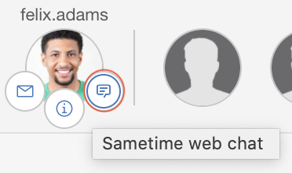
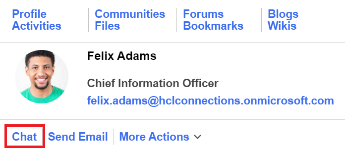
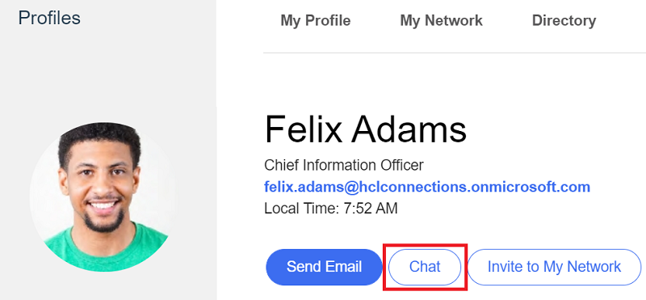

# Sametime 1-1 Chat
The appregistry extensions in this folder enables 1-1 Sametime chat from the important to me bar, the bizcard and the user profile page in Connections.

The json can either be imported from file or copied / pasted into the code editor of the appregistry client to create the extensions.

## Important to Me
Start a Teams chat directly from an ITM bubble:  


The example extension [sametime-itm.json](./sametime-itm.json) contains an actions to launch a Sametime web chat in a new browser tab from the ITM user bubble.
   
## Bizcard & Profiles
This extension is used to enable the Sametime 1-1 chat for both bizcard and profile page. 

*Note*: This extension requires Connections 7.0 or later.

Start a chat directly from the bizcard:  


Start a chat directly from the profile:  


The json from [sametime-profile-bizcard.json](./sametime-profile-bizcard.json) can either be imported from file or copied / pasted into the code editor of the appregistry client to create the extension.


## Sametime user identity key

If your deployment is using Sametime 11.6, then it should support the email address when starting a conversation using a URL similar to https://webchat.example.com/chat/conversations/johndoe%40example.com. However, earlier versions will not support emsil address, or you may require an identifier value that is different than the value provisioned for a Connection's profiles email address.  If this is the case, the profiles attribute `chatIdentity` can be used.  Update the URL used by the ITM and the Bizcard extensions to use the attribute `${chatIdentity}` instead of `${email}`.

The chatIdentity attribute must be provisioned to each user's Connections profile as an extended attribute.  See the topic [Integrating Chat using chatIdentity](https://opensource.hcltechsw.com/connections-doc/v7/configuringv7features/chatIintegration/chat_integ.html) for more information.

## Translations
The example extensions contain a limited number of translations as a way to demonstrate the technique. An administrator can add their own translations for the languages they desire by simply copying and pasting one of the langugage definition blocks, inserting the correct locale designation (e.g. es, ru, it, etc) and adding the desired string in the value attribute.

For example, to add Spanish translation for the bizcard and profile chat text, add a new language block like this:

```json
"es": {
   "SametimeBizcardChat-Connections_text": "Charla"
},
```