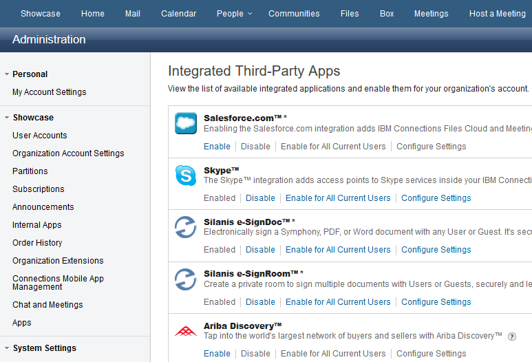
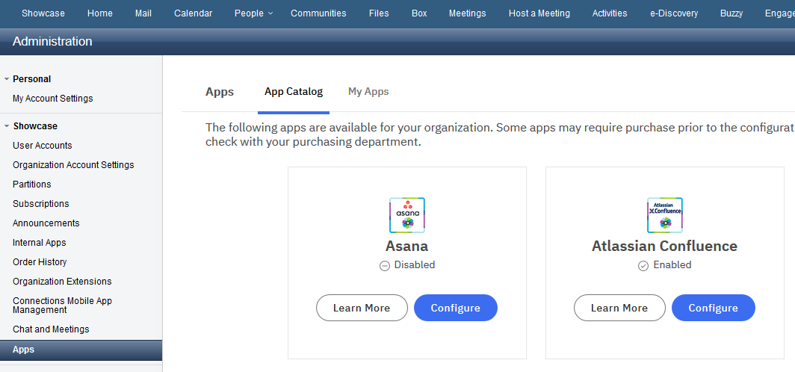
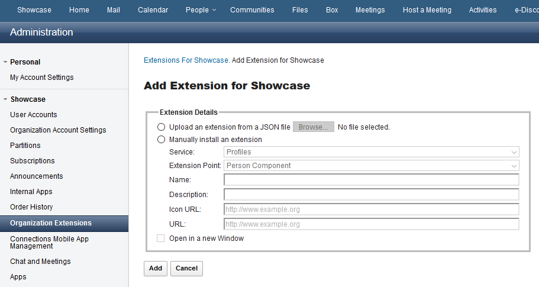
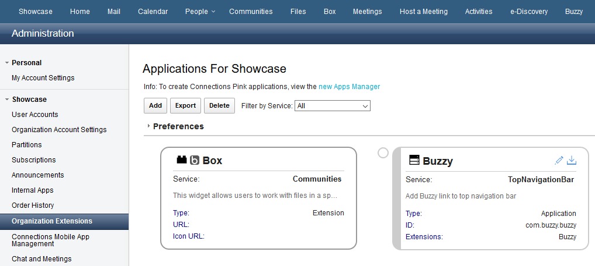
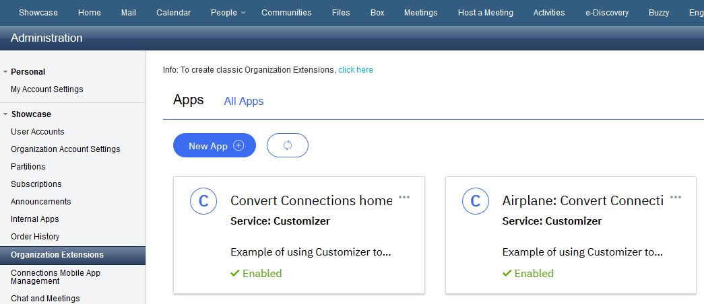
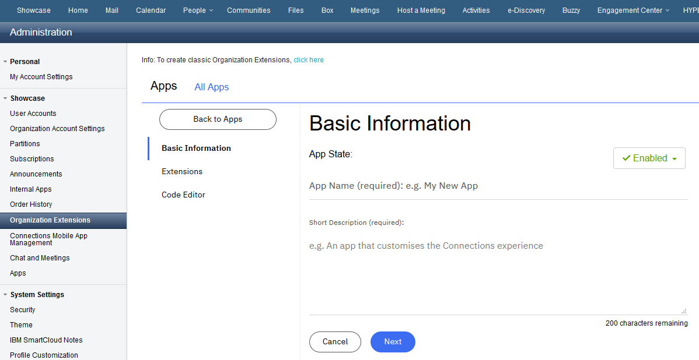
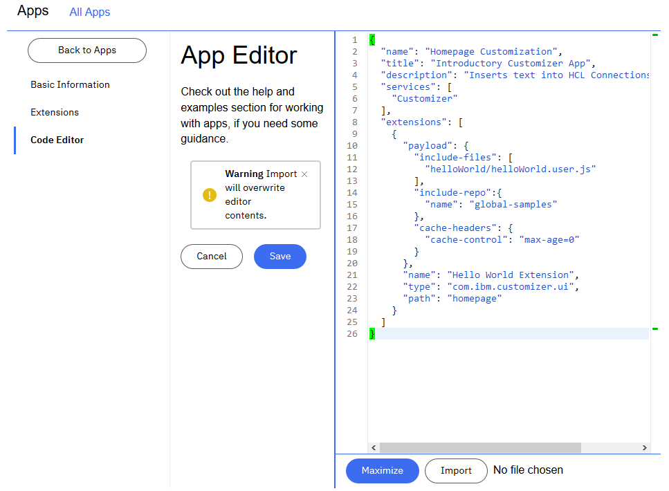
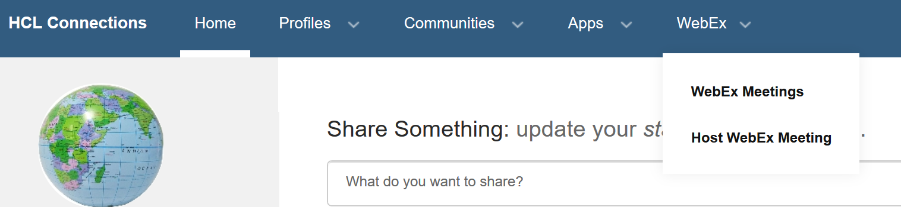

***WORKING DRAFT - SUBJECT TO CHANGE***

- [1. Connections Cloud Application Extension Migration](#1-connections-cloud-application-extension-migration)
  - [1.1 History and Versioning](#11-history-and-versioning)
    - [1.1.1 V1 / V2 Extensions](#111-v1--v2-extensions)
    - [1.1.2 V3 Extensions](#112-v3-extensions)
  - [1.2 Extensions Supported in Connections Cloud](#12-extensions-supported-in-connections-cloud)
  - [1.3 Extensions Supported in Connections MSP](#13-extensions-supported-in-connections-msp)
- [2. Migrating Extensions](#2-migrating-extensions)
  - [2.1 Migrating Existing V3 Extensions](#21-migrating-existing-v3-extensions)
  - [2.2 Migrating App Catalog (V1/V2) Extensions](#22-migrating-app-catalog-v1v2-extensions)
    - [2.2.1 App Catalog Extension Exceptions](#221-app-catalog-extension-exceptions)
  - [2.3 Converting Activity Stream Gadgets](#23-converting-activity-stream-gadgets)
    - [2.3.1 Updates to Activity Stream Event Posts](#231-updates-to-activity-stream-event-posts)
  - [2.4 Converting Community Widget Extensions](#24-converting-community-widget-extensions)
  - [2.5 Converting Unsupported Extension Types to Customizer](#25-converting-unsupported-extension-types-to-customizer)
    - [2.5.1 Hosting the Custom JS / CSS Files](#251-hosting-the-custom-js--css-files)
    - [2.5.2 Example Navigation Bar Customizations](#252-example-navigation-bar-customizations)
  - [2.6 General Extension Conversions](#26-general-extension-conversions)
- [3. Getting Help](#3-getting-help)


# 1. Connections Cloud Application Extension Migration

## 1.1 History and Versioning
In Connections Cloud, there are effectively 3 versions of extensions; referred to hereafter as v1, v2 and v3.

Before discussing the migration paths and processes, it is important to level set on the types of extensions and how they have come to exist in Connections Cloud.

### 1.1.1 V1 / V2 Extensions
These types of extensions would have been generated in the following ways:

1. From the original **Integrated 3rd Party Apps** page, by enabling one or more of the available integrations:

    

2. From the newer **Apps Catalog**, by enabling one or more of the available integrations:

    

3. Manually by an organization administrator, based on documented examples, using the organization extensions page form or by uploading a json file with the correct elements to define one or more extensions:

    

As an organization administrator, the **Organization Extensions** page (shown below) would then display and allow interaction with those v1/v2 extensions after they had been created:



### 1.1.2 V3 Extensions
For managing v3 extensions, most notably used in conjunction with services such as Customizer, OrientMe, etc., an organization administrator would be using the new Apps Manager page (shown below) accessed via **/appreg/apps** uri:



These types of extensions would be generated in the following ways:

1. Using the new application wizard and stepping through the required inputs:

    

2. Copying and pasting or importing from file the json content with the correct elements to define one or more extensions:

    

## 1.2 Extensions Supported in Connections Cloud
The following table lists the supported extension types, that would have been generated using one of the aforementioned methods, and a brief summary of their purpose:

| Extension Type                      | Version | Purpose                                                                                |
| ----------------------------------- | ------- | -------------------------------------------------------------------------------------- |
| Activity Stream Event (as_event)    | v1      | Enables embedded experience support on homepage updates stream                         |
| Community App (community_widget)    | v1      | Ability to add org specific widgets (available on 'Add App' in community actions)      |
| Contact Record (contact_record)     | v1      | Ability to add button to the contact page                                              |
| File Menu (file_menu)               | v1      | Ability to add menu/link to the 'File' menu                                            |
| New File Menu (new file_menu)       | v1      | Ability to add menu/link to the top level 'New' file menu/button                       |
| Person Component (person_component) | v1      | Ability to add action link to the More Actions menu on user profile page               |
| Top Navigation Bar (service_menu)   | v2      | Ability to add menu/link to the top navigation bar                                     |
| Verse                               | v2      | Ability to add menu/link to Verse instances of top navigation bar and biz card         |
| Customizer                          | v3      | Ability to inject custom js / css files into pages to modify behaviour / look and feel |
| OrientMe                            | v3      | Ability to modify or add menu/link actions on the OrientMe tile                        |
| ImportantToMe                       | v3      | Ability to modify existing or create custom ITM bar entries                            |
| Notifications                       | v3      | Ability to customize the layout and look / feel of the notification emails             |
| People                              | v3      | Ability to customize the type of profile for a user                                    |

## 1.3 Extensions Supported in Connections MSP
The following table shows the disposition of these extension types in an MSP-hosted environment:

| Extension Type                      | Version | Supported | Transition Path                                                   |
| ----------------------------------- | ------- | --------- | ----------------------------------------------------------------- |
| Activity Stream Event (as_event)    | v1      | Yes       | Convert to v3 format, import into MSP apps mgr UI                 |
| Community App (community_widget)    | v1      | Yes       | Convert to v3 format, import into MSP apps mgr UI                 |
| Contact Record (contact_record)     | v1      | **NO**    | Connections does not have contact records                         |
| File Menu (file_menu)               | v1      | Yes       | Convert to use Customizer, import into MSP apps mgr UI            |
| New File Menu (new file_menu)       | v1      | Yes       | Convert to use Customizer, import into MSP apps mgr UI            |
| Person Component (person_component) | v1      | Yes       | Convert to use Customizer, import into MSP apps mgr UI            |
| Top Navigation Bar (service_menu)   | v2      | Yes       | Convert to use Customizer, import into MSP apps mgr UI            |
| Verse                               | v2      | **NO**    | Verse extensions not supported                                    |
| Customizer                          | v3      | Yes       | Direct export from cloud apps mgr UI, import into MSP apps mgr UI |
| OrientMe                            | v3      | Yes       | Direct export from cloud apps mgr UI, import into MSP apps mgr UI |
| ImportantToMe                       | v3      | Yes       | Direct export from cloud apps mgr UI, import into MSP apps mgr UI |
| Notifications                       | v3      | Yes       | Direct export from cloud apps mgr UI, import into MSP apps mgr UI |
| People                              | v3      | Yes       | Direct export from cloud apps mgr UI, import into MSP apps mgr UI |

# 2. Migrating Extensions
The overall process is as follows:

1. Review the different integrations and customizations that are already defined in your organization.

2. Document all of the extensions visible in the **Organization Extensions** page; these extensions are the combined v1 or v2 extensions.

    The application and extension information shown in this page can be retrieved using the URL requests described below in the browser by an administrator.

    Each request returns a JSON response containing an array under the **items** key.

    - **V1 Extension** info:  
      https://apps.xx.collabserv.com/appregistry/api/v1/extensions?limit=9999&showDefaults=false

    - **V2 Application** info:  
      https://apps.xx.collabserv.com/appregistry/api/v2/applications?limit=9999  

    - **V2 Extension** info:  
      For each item of the application array, there is an **extensions_href** link that will retrieve the associated extensions for that application

3. Document all of the extensions visible in the **Apps Manager** page; these extensions are v3.

    The application and extension information shown in this page can be retrieved using the URL requests described below in the browser by an administrator.

    Each request returns a JSON response containing an array under the **items** key.

    - **V3 Application** info:  
      https://apps.xx.collabserv.com/appregistry/api/v3/applications?limit=9999  

    - **V3 Extension** info:  
      For each item of the application array, there is an **extensions_href** link that will retrieve the associated extensions for that application


4. Determine which are necessary to migrate to the MSP environment; disable those that are believed to be redundant and wait a short while to make sure users are not impacted.

5. Look at the types of extensions that are required and map the list against the preceeding tables so you know which migration approach is required for each extension.

6. Download the pre-defined V3 app catalog extensions (detailed in section [2.2 Migrating App Catalog (V1/V2) Extensions](#22-migrating-app-catalog-v1v2-extensions)) and load into the Apps Manager in the MSP environment and test.

7. Create new versions of any custom extensions and load into the Apps Manager in the MSP environment and test.

## 2.1 Migrating Existing V3 Extensions
Starting with the easiest to transition, for items that are already found in the Apps Manager UI in Connections Cloud, the administrator can copy / paste the JSON into files for safe keeping and then use those files for import into the Apps Manager UI in the MSP environment.

Once loaded, the functionality can be verified in the MSP environment.

## 2.2 Migrating App Catalog (V1/V2) Extensions
For each of the application entries in the application catalog, a V3 version of the related application and extensions has been created in the [appcatalog-v3](../appcatalog-v3) directory.

There is a single application json file per catalog entry and within the file are each of the extensions that used to be generated when the catalog item was configured. These also show the necessary structure for a v3 application with associated extension(s).

Download the json file for each of the applications that were in Connections Cloud and that need to be migrated then import them one by one into the Apps Manager UI in the MSP environment and test.

| Application Name                   | Link to Extension                                                                                  |
| ---------------------------------- | -------------------------------------------------------------------------------------------------- |
| Asana                              | [io.appspokes.asana.json](../appcatalog-v3/io.appspokes.asana.json)                                   |
| Atlassian Confluence               | [io.appspokes.confluence.json](../appcatalog-v3/io.appspokes.confluence.json)                         |
| Atlassian JIRA                     | [io.appspokes.jira.json](../appcatalog-v3/io.appspokes.jira.json)                                     |
| Box                                | [io.appspokes.box.json](../appcatalog-v3/io.appspokes.box.json)                                       |
| Buzzy                              | [com.buzzy.buzzy.json](../appcatalog-v3/com.buzzy.buzzy.json)                                         |
| Cisco Jabber                       | [com.cisco.jabber.json](../appcatalog-v3/com.cisco.jabber.json)                                       |
| Cisco Spark                        | [com.cisco.spark.json](../appcatalog-v3/com.cisco.spark.json)                                         |
| Cisco WebEx                        | [com.cisco.webex.json](../appcatalog-v3/com.cisco.webex.json)                                         |
| Cisco WebEx Mobile for iOS         | Not Available                                                                                      |
| Community Engagement Center        | [com.hcl.icec.json](../appcatalog-v3/com.hcl.cec.json)
| Customizer Nifty Scripties         | [com.nifty.scripties.json](https://github.com/ibmcnxdev/global-samples/blob/master/nifty-scripties/niftyScriptiesApp.json)                                |
| DropBox                            | [io.appspokes.dropbox.json](../appcatalog-v3/io.appspokes.dropbox.json)                               |
| GitHub                             | [io.appspokes.github.json](../appcatalog-v3/io.appspokes.github.json)                                 |
| GitLab                             | [io.appspokes.gitlab.json](../appcatalog-v3/io.appspokes.gitlab.json)                                 |
| Google Drive                       | [io.appspokes.googledrive.json](../appcatalog-v3/io.appspokes.googledrive.json)                       |
| IBM Watson Workspace               | Not Available                                                                                      |
| Kudos Boards                       | [com.isw.kudosboards.json](../appcatalog-v3/com.isw.kudosboards.json)                                 |
| Kudos Ideas                        | [com.isw.kudosideas.json](../appcatalog-v3/com.isw.kudosideas.json)                                   |
| OneDrive for Business              | [io.appspokes.onedrive.for.business.json](../appcatalog-v3/io.appspokes.onedrive.for.business.json)   |
| Preview features for HCL CNX Cloud | [com.ibm.connections.preview.json](../appcatalog-v3/com.ibm.connections.preview.json)                 |
| ProjExec Live                      | [com.trilog.projexeclive.json](../appcatalog-v3/com.trilog.projexeclive.json)                         |
| QuickConnect                       | [io.appspokes.quick.connect.json](../appcatalog-v3/io.appspokes.quick.connect.json])                  |
| Salesforce                         | [io.appspokes.salesforce.json](../appcatalog-v3/io.appspokes.salesforce.json)                         |
| SharePoint Online                  | [io.appspokes.sharepoint.online.json](../appcatalog-v3/io.appspokes.sharepoint.online.json)           |
| SugarCRM                           | Not Available                                                                                      |
| TalkTeam                           | [com.e-office.talkteam.json](../appcatalog-v3/com.e-office.talkteam.json)                             |
| Visual Update 1 for HCL CNX        | [com.ibm.connections.periscope.json](https://github.com/ibmcnxdev/cnx-custom-theme/blob/master/vu1-include-css.json) |
| WordPress                          | [io.appspokes.wordpress.json](../appcatalog-v3/io.appspokes.wordpress.json)                           |
| Wrike                              | [io.appspokes.wrike.json](../appcatalog-v3/io.appspokes.wrike.json)                                   |
| Zendesk                            | [io.appspokes.zendesk.json](../appcatalog-v3/io.appspokes.zendesk.json)                               |
| Zoom Meetings                      | Not Available                                                                                      |
| e-SignDoc	/ e-SignRoom             | [com.silanis.e-sign.json](../appcatalog-v3/com.silanis.e-sign.json)                                   |

### 2.2.1 App Catalog Extension Exceptions
Some of the applicaton definitions, listed in the prior table, include extension types that are not supported as-is. Those were described in section [1.3 Extensions Supported in Connections MSP](#13-extensions-supported-in-connections-msp) as requiring conversion to use Customizer-based implementations instead and examples of them are referenced in [2.5 Convert Unsupported Extensions to Customizer](#25-converting-unsupported-extension-types-to-customizer).

Even though they will not have the same effect in the MSP environment as in Connections Cloud, they have been left in place **for reference**.

Section [2.5.2 Example Navigation Bar Customizations](#252-example-navigation-bar-customizations) shows an example for a navigation bar customization. Re-use the relevant information (typically link label text and url link) from the application definitions available above in creation of the Customizer-based extensions.

Once the new customizations are working, that specific extension information can be removed from the application definitions that were used from above.

## 2.3 Converting Activity Stream Gadgets
Activity stream gadgets (extension type 'gadget') are used to define embedded experiences on which users can take action from events in their activity stream; either on the classic homepage or on the OrientMe homepage.

They typically declare the details needed to render the associated content of the application and links to actions within the external application.

Below is an example of a v2 activity stream gadget definition from one of the existing 3rd party catalog applications:
```json
{
  "text": "Asana Embedded Experience",
  "description": "Asana Embedded Experience",
  "icon": "https://asana-dev.appspokes.net/assets/images/asana.png",
  "url": "https://asana-dev.appspokes.net/stream/experience/render",
  "extends": "as_event",
  "type": "gadget",
  "mime_type": "",
  "enabled": "true"
}
```
In order to convert this to a format acceptable to the v3 app registry, it needs additional attributes to be defined around the original extension payload.

The extension itself is placed in an extensions: [] array, since an application definition can contain 1-to-N extensions, and has a few extra attributes applied:

| Extension Attribute Name | Purpose / Example                                                                                              |
| ------------------------ | -------------------------------------------------------------------------------------------------------------- |
| name                     | Replaces the text attribute; shows in the appregistry UI                                                       |
| description              | Same as the original attribute                                                                                 |
| ext_id                   | Usually a unique reverse domain notation that extends the application name (see below)                         |
| type                     | *gadget* (same as the original attribute)                                                                      |
| state                    | Replaces the *enabled: true\|false* attribute to determine if this particular extension is enabled or disabled |
| payload                  | Encloses all of the other original attributes                                                                  |

So taking the original extension json that would then be transformed into something like this:
```json
"extensions": [
    {
      "name": "Asana Embedded Experience",
      "description": "Asana Embedded Experience",
      "ext_id": "io.appspokes.asana.v3.embedded",
      "type": "gadget",
      "state": "enabled",
      "payload": {
        "extends": "as_event",
        "icon": "https://asana-dev.appspokes.net/assets/images/asana.png",
        "mime_type": "",
        "url": "https://asana-dev.appspokes.net/stream/experience/render"
      }
    }
  ]
```
The newly created extensions array is now wrapped in an outer application definition, where these attributes must be added:

| Application Attribute Name | Purpose / Example                                               |
| -------------------------- | --------------------------------------------------------------- |
| app_id                     | Usually a unique reverse domain notation                        |
| description                | Description of the application displayed on appregistry UI card |
| name                       | The name of the application                                     |
| services                   | *Connections* (the services to which it applies)                |
| state                      | Whether the entire app definition is *enabled* or *disabled*    |
| title                      | Displayed on the appregistry UI card                            |

```json
{
  "app_id": "io.appspokes.asana.v3",
  "description": "Asana",
  "name": "Asana",
  "services": [
    "Connections"
  ],
  "state": "disabled",
  "title": "Asana",
  "extensions": [
    {
      "name": "Asana Embedded Experience",
      "description": "Asana Embedded Experience",
      "ext_id": "io.appspokes.asana.v3.embedded",
      "type": "gadget",
      "payload": {
        "extends": "as_event",
        "icon": "https://asana-dev.appspokes.net/assets/images/asana.png",
        "mime_type": "",
        "url": "https://asana-dev.appspokes.net/stream/experience/render"
      }
    }
  ]
}
```
This should now be able to be pasted into the appregistry UI code editor and be saved.

When the embedded experience is invoked by a user from the activity stream, if the extension is not registered, is not enabled or the url does not match the url of the open social context in the activity stream post, an error will be displayed saying the url is not whitelisted. The gadget extension, as shown in the example above, is the configuration item that permits access to the URL of the embedded experience. In this way, there is a simple enable / disable option for the embedded experience defined by the extension.

Remember there are examples in many of the 3rd party application definitions already provided in the [appcatalog-v3](../appcatalog-v3) directory.

**Note:**
In reality this activity stream gadget and the following community widget definition both relate to the Asana application. They have been purposely separated here just for illustration purposes. That is why the application name and app_id are not unique in these two separate examples, because they are typically defined as a single application definition.

They are combined in the actual example json file for this application [io.appspokes.asana.json](../appcatalog-v3/io.appspokes.asana.json) with both extensions together in the extensions array.

### 2.3.1 Updates to Activity Stream Event Posts
This document [Working with Activity Streams in the Cloud](https://ds-infolib.hcltechsw.com/ldd/appdevwiki.nsf/xpDocViewer.xsp?lookupName=Dev+Guide+topics#action=openDocument&res_title=Working_with_Activity_Streams_in_the_Cloud&content=pdcontent) contains a reference to the gadget URL that must be used when posting events to the Activity Stream in the Connections Cloud:

Parameter | Value
--------- | -----
gadget | The only URL that will be executed as an embedded experience. The Gadget URL must be: https://apps.na.collabserv.com/connections/resources/web/com.ibm.social.ee.cloud/cloudee.xml

For Connections MSP deployments, the basic URL structure is similar but since each organization will have a unique vanity host name, a relative URI can be used instead:

Parameter | Value
--------- | -----
gadget | The only URL that will be executed as an embedded experience. The Gadget URL must be: [/connections/resources/web/com.ibm.social.ee.cloud/cloudee.xml](/connections/resources/web/com.ibm.social.ee.cloud/cloudee.xml)


Therefore, applications that post events into the Activity Stream will need to be modified to account for this change.

## 2.4 Converting Community Widget Extensions
Community widgets (extension type 'community_widget') appear on the *Add Apps* panel of the community actions menu and once added to a community, define the details used to render the widget on the page and the tab in the community navigation.

Below is an example of a v2 community widget definition:

```json
{
  "name": "Asana - My Tasks",
  "description": "",
  "type": "community_widget",
  "payload": {
    "modes": "view",
    "defId": "Asana - My Tasks",
    "uniqueInstance": "false",
    "primaryWidget": "true",
    "showInPalette": "true",
    "themes": "wpthemeThin wpthemeNarrow wpthemeWide wpthemeBanner",
    "url": "/connections/resources/web/com.ibm.social.urliWidget.web.resources/widget/urlWidget.xml",
    "itemSet": [
      {
        "value": "600px",
        "name": "height"
      },
      {
        "value": "100%",
        "name": "width"
      },
      {
        "name": "url",
        "value": "https://asana-dev.appspokes.net/communityapp/tasks/render"
      }
    ]
  }
}
```
The process is similar as for the activity stream gadget.

The extension payload is again wrapped in the extensions array, with any additional required attributes added, and all of that inside an application defintition:

```json
{
  "app_id": "io.appspokes.asana.v3",
  "description": "Asana",
  "name": "Asana",
  "services": [
    "Communities"
  ],
  "state": "enabled",
  "title": "Asana",
  "extensions": [
    {
      "description": "Asana - My Tasks",
      "ext_id": "io.appspokes.asana.v3.mytasks",
      "name": "Asana - My Tasks",
      "type": "community_widget",
      "url": "/connections/resources/web/com.ibm.social.urliWidget.web.resources/widget/urlWidget.xml",
      "payload": {
        "defId": "Asana - My Tasks",
        "themes": "wpthemeThin wpthemeNarrow wpthemeWide wpthemeBanner",
        "modes": "view",
        "primaryWidget": "true",
        "showInPalette": "true",
        "uniqueInstance": "false",
        "itemSet": [
          {
            "name": "width",
            "value": "100%"
          },
          {
            "name": "height",
            "value": "600px"
          },
          {
            "name": "url",
            "value": "https://asana-dev.appspokes.net/communityapp/tasks/render"
          }
        ]
      }
    }
  ]
}
```

Remember there are examples in many of the 3rd party application definitions already provided in the [appcatalog-v3](../appcatalog-v3) directory.

## 2.5 Converting Unsupported Extension Types to Customizer
Customizer-based modifications have 2 main parts:

1. A file containing the json definition of the extension describing what JS / CSS files to inject in the Connections html page response. The json content should be copied / pasted or imported into the Apps Manager UI and saved as a v3 extension.

2. The actual custom JS and/or CSS files that are used to implement the customization, which must be stored in the appropriate file system location, on the Connections MSP environment.

Below you will find example implementations for the extension types that should be replaced with Customizer-based equivalents:

| Extension Type                      | Link to Example                                              |
| ----------------------------------- | ------------------------------------------------------------ |
| File Menu (file_menu)               | [File Menu Examples](../customizations/file_menu)               |
| New File Menu (new_file_menu)       | [New File Menu Examples](../customizations/new_file_menu)       |
| Person Component (person_component) | [Person Component Examples](../customizations/person_component) |
| Top Navigation Bar (service_menu)   | [Top Navigation Bar Examples](../customizations/service_menu)   |

Use these examples, and for each of the existing extensions of these types that need to be converted, make a copy of the example files and update with the specific text, url links and other attributes that mimick what the old extensions previously contained.

### 2.5.1 Hosting the Custom JS / CSS Files
The custom JS and CSS files that implement organization specific customizations must be hosted in a persistent volume (PV) accessible to the Customizer (mw-proxy) microservice.

In a standard Component Pack deployment this is typically **/pv-connections/customizations**. Under this directory an MSP will create a sub-directory per organization, in which the relevant files for each organization can be stored.
```
/ pv-connections  
  | 
  └── customizations
      | 
      ├─── orgA
      |    |
      |    ├─── customization1
      |    |    ├──  myCustom1.js
      |    |    └──  myCustom1.css
      |    |
      |    └─── customization2
      |          ├──  myCustom2.js
      |          └──  myCustom2.css
      └─── orgB
           |
           └──── customization1
                 ├──  myCustom1.js
                 └──  myCustom1.css

```
The Customizer extension definitions would then reference those files using a relative directory path such as this for org A:

```json
"payload": {
    "include-files": [
        "orgA/customization1/myCustom1.js"
        "orgA/customization1/myCustom1.css"
```

```json
"payload": {
    "include-files": [
        "orgA/customization2/myCustom2.js"
        "orgA/customization2/myCustom2.css"
```

and this for org B, etc:

```json
"payload": {
    "include-files": 
        "orgB/customization1/myCustom1.js"
        "orgB/customization1/myCustom1.css"
```

The directory names are arbitrary and can be called anything so long as they are unique and a customer administrator knows their structure so as to reference them properly in the extension definitions.

### 2.5.2 Example Navigation Bar Customizations
The following is an example for adding a menu and links to the top navigation bar.

1. Obtain the structure of the existing top navigation bar extension(s) for reference, which should look something like this. The relevant lines that will be re-used are highlighted with -->> just for the purposes of this documentation:
   
```json
{
  "appId": "com.cisco.webex",
  "exts":[
    {
       "app_id" : "com.cisco.webex",
       "description" : "Add WebEx links to top navigation bar",
       "extensions" : [
         {
            "applications" : [ "WebExMeetings" ],
            "description" : "Host WebEx meeting link",
            "ext_id" : "com.cisco.webex.menu.hostmeeting",
      -->>  "name" : "Host WebEx Meeting",
            "path" : "WebExMenu.2",
            "payload" : {
      -->>     "link" : "https://${webex_site}/${webex_site_prefix}/e.php?AT=ST",
               "parameters" : {
                  "webex_site" : "example.webex.com",
                  "webex_site_prefix" : "example"
               },
               "target" : "_blank"
            },
            "title" : "Host WebEx Meeting",
            "translations" : null,
            "type" : "com.ibm.action.menu.link"
         },
         {
            "applications" : [ "WebExMeetings" ],
            "description" : "Launch WebEx meeting link",
            "ext_id" : "com.cisco.webex.menu.webexmeetings",
      -->>  "name" : "WebEx Meetings",
            "path" : "WebExMenu.1",
            "payload" : {
      -->>     "link" : "https://${webex_site}/",
               "parameters" : {
                  "webex_site" : "example.webex.com"
               },
               "target" : "_blank"
            },
            "title" : "WebEx Meetings",
            "translations" : null,
            "type" : "com.ibm.action.menu.link"
         },
         {
            "applications" : [ "WebExMeetings" ],
            "description" : "WebEx Menu",
            "ext_id" : "com.cisco.webex.menu",
      -->>  "name" : "WebEx",
            "path" : "com.ibm.navbar.order.47000",
            "payload" : null,
            "title" : "WebEx Menu",
            "translations" : null,
            "type" : "com.ibm.action.menu",
            "widget" :{
              "mandatory": true,
              "hide": true
            }
         }
       ],
       "icon" : "",
       "name" : "WebExMeetings",
       "payload" : null,
       "entitlement" : "isv_webex",
       "service" : "TopNavigationBar",
       "version": "v2",
       "title" : "WebEx Meetings",
       "url" : ""
    }
  ]
}

```

1. Take the navbar customization [example](../customizations/service_menu/custom-navbar.js). 

   Update the example JS with the relevant label and link attributes from the original extension as shown above, to look something like below. Modified lines where changes were made for labels and text are highlighted with -->> just for the purposes of this documentation.

   In this particular WebEx case, the URL links used variable substitution to construct the actual link so in reality this:
   ```json
   "link" : "https://${webex_site}/${webex_site_prefix}/e.php?AT=ST",
               "parameters" : {
                  "webex_site" : "example.webex.com",
                  "webex_site_prefix" : "example
   ```
   would become this when reconstructed for use in the new JS:
   ```json
   "https://example.webex.com/example/e.php?AT=ST"
   ```
   In simpler cases there may just be simple static URL link.

   Note that this example adds 2 submenu links so there are two calls to the `createSubmenu` function. If you add more or fewer links you would add or remove createSubmenu calls; there should be a 1-1 mapping of createSubmenu calls to links being added.
   
```js
(function () {
    'use strict';
    if (typeof (dojo) != "undefined") {
        require(["dojo/dom-construct", "dojo/dom", "dojo/query", "dojo/string", "dojo/on", "dojo/mouse"], function (domConstruct, dom, query, string, on, mouse) {
            try {
                // utility function to let us wait for a specific element of the page to load...
                var waitFor = function (callback, elXpath, elXpathRoot, maxInter, waitTime) {
                    if (!elXpath) return;
                    var root = elXpathRoot ? elxpathRoot : dojo.body();
                    var maxInterval = maxInter ? maxInter : 10000; // number of intervals before expiring
                    var interval = waitTime ? waitTime : 1; // 1000=1 second
                    var waitInter = 0; // current interval
                    var intId = setInterval(function () {
                        if (++waitInter < maxInterval && !dojo.query(elXpath, root).length) return;

                        clearInterval(intId);
                        if (waitInter >= maxInterval) {
                            console.log("**** WAITFOR [" + elXpath + "] WATCH EXPIRED!!! interval " + waitInter + " (max:" + maxInter + ")");
                        } else {
                            console.log("**** WAITFOR [" + elXpath + "] WATCH TRIPPED AT interval " + waitInter + " (max:" + maxInter + ")");
                            callback();
                        }
                    }, interval);
                };
                // Create menu wrapper (top level navbar menu with dropdown menu)
                // nodeParent - navbar container element
                // nodeId - unique id for this top navbar menu item
                // menuTitle - navbar menu item text
                // menuLink - navbar menu link, to launch if the user clicks on this menu item
                var createMenuWrapper = function (nodeParent, nodeId, menuTitle) {
                    if (nodeParent && !dojo.query("#" + nodeId)[0]) {
                        var host = '';
                        var template = '<a onmouseover="dojo.require(\'lconn.core.header\');lconn.core.header.menuMouseover(this);" onclick="dojo.require(\'lconn.core.header\');lconn.core.header.menuClick(this); _lconn_menuid="lconnheadermenu-${menuTitle}" aria-label="${menuTitle}">${menuTitle}<span class="lotusAltText">▼</span></a>';
                        var html = string.substitute(template, {
                            menuTitle,
                            host
                        }, string.escape);
                        return domConstruct.create(
                            "li", {
                                id: nodeId,
                                innerHTML: html
                            },
                            nodeParent
                        );
                    } else {
                        throw new Error("Error couldn't find the node parent to insert menu wrapper");
                    }
                };
                // Create submenu under the navbar menu
                // topNavMenuText - to query if the div container with aria-label exists in the flyout dialog (drop down menu)
                // menuId - create a unique submenu id
                // menuTitle - create the submenu title
                // menuLink - create the submenu link, to launch in a separate browser if user clicks on this submenu
                var createSubmenu = function (topNavMenuText, menuId, menuTitle, menuLink) {
                    // create submenu if it doesn't exist by menuId
                    if (topNavMenuText && !dojo.query("#" + menuId)[0]) {
                        // query <div data-dojo-attach-point="containerNode" aria-label=<nav_menu_text>
                        var dialogBody = dojo.query(`div[aria-label=\"${topNavMenuText}\"]`)[0];
                        // query if the table exists
                        var tableBody = dojo.query('table > tbody', dialogBody)[0];
                        // if table doesn't exist, create it once
                        if (!tableBody) {
                            var templateTbl = '<table dojotype="dijit._Widget" class="lotusLayout" cellpadding="0" cellspacing="0" role="presentation" id="dijit__Widget_4" widgetid="dijit__Widget_4"><tbody/></table>';
                            var div = domConstruct.create(
                                "div", {
                                    role: "document",
                                    innerHTML: templateTbl
                                },
                                dialogBody
                            );
                            tableBody = dojo.query('tbody', div)[0];
                        };
                        if (dialogBody && tableBody) {
                            var templateTD = '<td class="lotusNowrap lotusLastCell"><a class="lotusBold" href="${menuLink}" target="_blank">${menuTitle}</a></td>';
                            var html = string.substitute(templateTD, {
                                menuTitle,
                                menuLink
                            }, string.escape);
                            return domConstruct.create(
                                "tr", {
                                    id: menuId,
                                    innerHTML: html
                                },
                                tableBody
                            );
                        };
                    };
                };
              
                // here we use waitFor page to load
                // before we proceed to customize the navbar with the menu
                waitFor(function () {
                        console.log('customNavbar loaded');
                        //
                        // 1) get the top navbar <ul>
                        var navbar = dojo.query("ul.lotusInlinelist.lotusLinks")[0];
                        //
                        // 2) create the top link menu wrapper
                        var topNavMenuId = "btn_actn__add_menu_wrapper_1";
                  -->>  var topNavMenuText = "WebEx";
                        var menuWrapper = createMenuWrapper(navbar, topNavMenuId, topNavMenuText);
                        //
                        // 3) create the submenus and links
                        // this is where you define the custom menu text, link text and urls
                        // enumerate each pair of labels and urls 1,2,3,4,5,etc.
                        var subMenuId = "btn_act__add_submenu1";
                  -->>  var subMenuText = "WebEx Meetings";
                  -->>  var subMenuLink = "https://example.webex.com";
                        var subMenuId2 = "btn_act__add_submenu2";
                  -->>  var subMenuText2 = "Host WebEx Meeting";
                  -->>  var subMenuLink2 = "https://example.webex.com/example/e.php?AT=ST";
                        // get the anchor element for the navbar menu
                        var anchor = dojo.query("a", menuWrapper)[0];
                        // add event when user enters the navbar menu
                        on(anchor, mouse.enter, function () {
                            // wait for the navbar dropdown menu to show
                            waitFor(function () {
                                // create one submenu
                                createSubmenu(topNavMenuText, subMenuId, subMenuText, subMenuLink);
                                // create another submenu
                                createSubmenu(topNavMenuText, subMenuId2, subMenuText2, subMenuLink2);
                            }, `div[aria-label=\"${topNavMenuText}\"]`);
                        });
                    },
                    "div.lotusBanner");
            } catch (e) {
                console.log("customNavbar error: " + e);
                alert("Exception in adding menu item: " + e);
            }
        });
    }
})();
``` 
  Then put this custom JS file in an appropriate directory on the MSP environment and reference it in the application definition.

3. Register a Customizer extension in the Apps Manager UI that references the custom JS file created in step 2 as shown below. Once in place, the navbar should be customized as desired once the page is loaded.
   
```json
{
  "name": "Navbar Link Customizations",
  "title": "Change navbar links",
  "description": "Add custom links into the navbar",
  "services": [
    "Customizer"
  ],
  "extensions": [
    {
      "payload": {
        "include-files": [
          "orgA/customNavbar/customNavbar.js"
        ],
        "cache-headers": {
          "cache-control": "max-age=43200"
        }
      },
      "name": "Custom Navbar Links",
      "type": "com.ibm.customizer.ui",
      "path": "global"
    }
  ]
}
```
With the custom JS on the MSP environment and the Customizer extension registered in the appregistry to reference it, given the labels used in the example above, the navigation bar should look like this:



If there are multiple customizations for the navbar, they could all be merged in a single JS file with a single extension definition (as above) referencing that file. This would result in the minimum number of browser requests, downloading just the one custom JS file containing all navbar changes.

This same general approach would be repeated for all other customizations or extensions requiring conversion for use in the Connections MSP environment.

## 2.6 General Extension Conversions
In addition to pre-defined application customizations mentioned previously, there may be other custom extensions that were hand-crafted by the organization administrator(s) or developer(s). These customizations will need to be handled according to their type and disposition as noted in the table in section [1.3 Extensions Supported in Connections MSP](#13-extensions-supported-in-connections-msp).

# 3. Getting Help
For assistance with this process, please reach out to your designated managed service provider (MSP).
